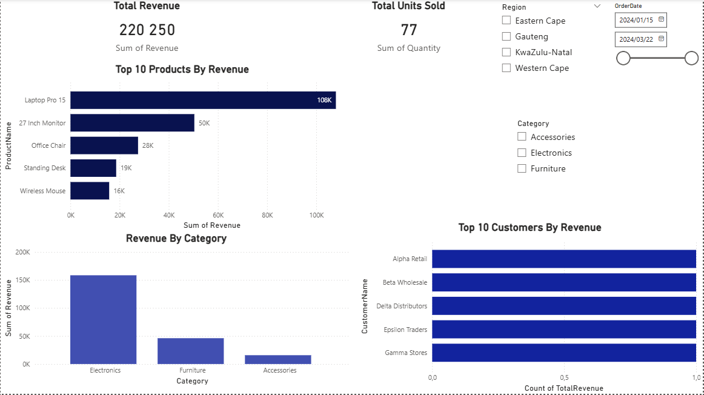
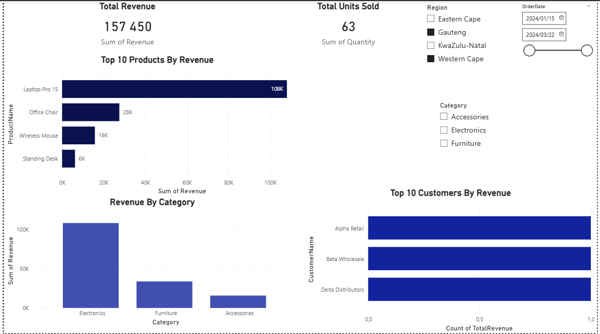
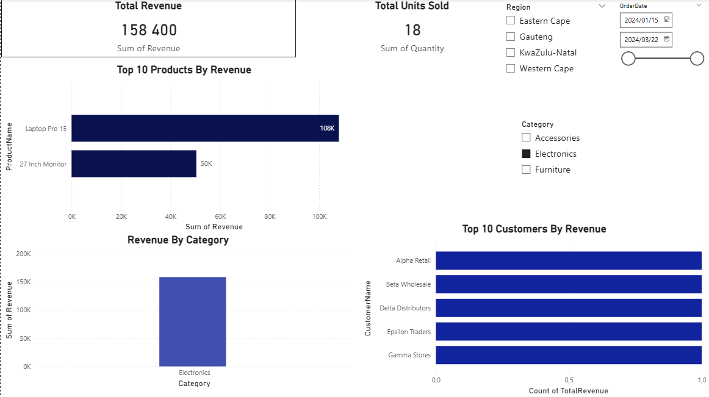
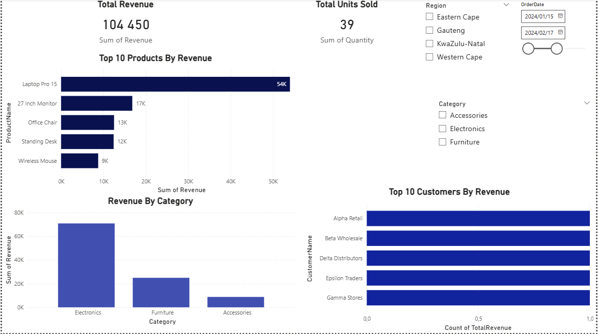

# Project 4: SQL & Power BI Sales Analysis

## 📌 Project Overview
This project demonstrates an end-to-end sales analysis workflow using **SQL Server** and **Power BI**.  
The objective was to design a relational dataset from scratch in SQL, perform analytical queries, and build an interactive Power BI dashboard to answer key business questions.

This project represents my **first Power BI dashboard** built directly from a SQL Server database, focusing on learning best practices in data modeling, interactivity, and dashboard design.

---

## 🎯 Business Questions Addressed
- Who are the **top-performing customers** by revenue?
- How does revenue vary across **product categories**?
- How do **filters such as region, category, and date** impact overall performance?
- Do changes in sales dimensions affect KPIs consistently across visuals?

---

## 🛠️ Tools & Technologies
- **SQL Server (SSMS 22)**
  - Database creation
  - Table design and relationships
  - Data insertion
  - Analytical SQL views
- **Power BI**
  - Direct connection to SQL Server
  - Data modeling
  - KPIs, charts, and slicers
  - Interactive filtering and visual synchronization

---

## 🗄️ SQL Data Model
The dataset was created entirely in SQL Server and includes:
- Customers
- Products (with categories and pricing)
- Orders
- Order items

To support analysis, multiple SQL views were created, including:
- Sales detail view
- Revenue by category
- Top products by revenue
- Top customers by revenue

All SQL scripts used in this project are available in the `sql/` folder.

---

## 📊 Power BI Dashboard
The Power BI report is a **single-page executive dashboard** designed to present clear and actionable insights.  
It includes:
- **Total Revenue KPI**
- **Total Units Sold KPI**
- **Top Customers by Revenue**
- **Revenue by Category**
- **Top Products by Revenue**

The dashboard uses slicers to dynamically filter data by:
- Region
- Product Category
- Date

All visuals are fully synchronized and respond consistently to slicer selections.

---

## 🖼️ Dashboard Screenshots

### Dashboard Overview
This view shows the full dashboard with no filters applied, providing a high-level summary of overall performance.
  

---

### Filtered by Region
This screenshot demonstrates how selecting a region updates all KPIs and charts simultaneously.
  

---

### Filtered by Product Category
This view highlights how revenue and customer performance change when filtering by a specific product category.
  

---

### Filtered by Date
This screenshot shows the dashboard filtered by date, illustrating time-based performance analysis.
  

---

## 📚 Key Learnings
- Designing and populating a relational database in SQL Server
- Writing analytical SQL queries and views
- Understanding how pre-aggregated data affects Power BI interactivity
- Building a clean, single-page Power BI dashboard
- Using slicers and visual interactions effectively
- Structuring and documenting a professional analytics project for GitHub

---

## 👤 Author
**Boiketlo T. Lorekang**  
GitHub: https://github.com/BoiketloTLorekang
